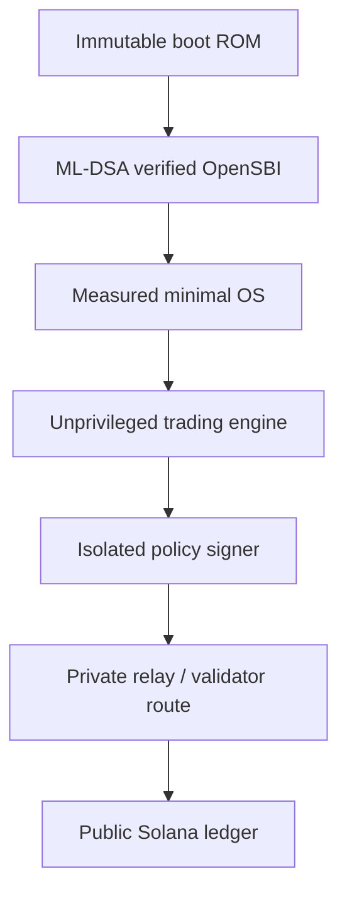
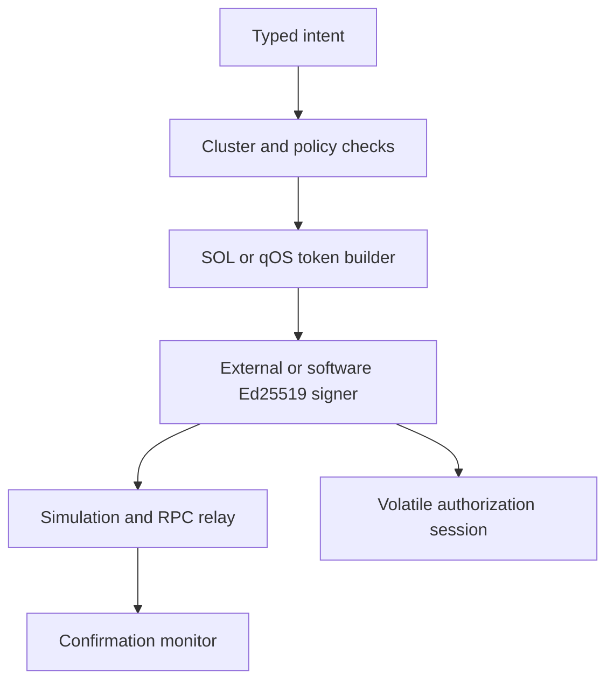
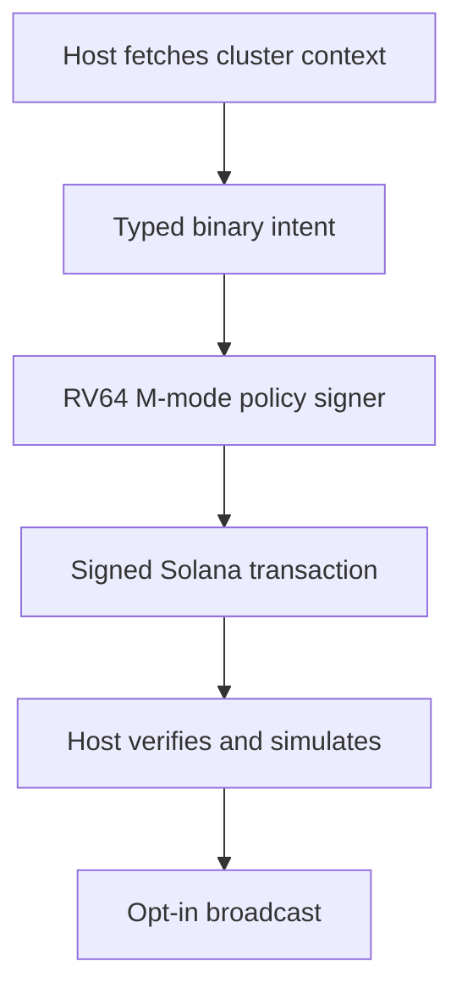

# Architecture and trust boundaries

The target is a secure trading appliance, not a monolithic "BIOS that trades."
Firmware, operating system, signer, and relay have different privilege and
failure domains.

## Firmware domain

The immutable boot ROM or first mutable stage performs these operations:

1. Quiesce DMA and lock the manifest plus candidate image window before the
   first read.
2. Snapshot the manifest once and validate fixed partition bounds.
3. Read rollback state through a fallible interface and reject older images.
4. Hash the next stage with SHA3-384.
5. Verify an ML-DSA-65 signature over a canonical, domain-separated manifest
   rooted in an immutable public key.
6. Extend a measured-boot register with every signed manifest field.
7. Authenticate or bind the handoff FDT to ROM-owned data, measure it, and lock
   it against mutation.
8. Lock root secrets and PMP configuration.
9. Atomically commit rollback state only after every preceding check succeeds.
10. Enter verified OpenSBI, which supplies the standard interface between
   machine-mode firmware and the supervisor-mode OS.

For resilience during migration, a production update format can require both
ML-DSA and a mature classical signature.  This is a policy choice; it does not
change Solana transaction signatures.

## OS domain

Use a reproducible, immutable image with:

- Read-only root filesystem and signed A/B updates
- IOMMU enabled and unused devices disabled
- No swap, core dumps, interactive compilers, or package manager
- Separate Unix identities and mandatory access control for market data,
  strategy, transaction construction, signer client, and relay client
- Outbound firewall allowlisting only configured RPC, time, and relay targets
- Local RPC responses treated as untrusted input
- Independent monitoring that has no signing authority

The OS may run on minimal Linux initially.  Writing a new kernel and a new
firmware stack at the same time would greatly enlarge the security boundary.

## Solana signer domain

Solana messages are signed with Ed25519, so the live Solana key must remain in
an isolated signer that implements Ed25519 even when the boot chain is
post-quantum protected.

The signer should accept a high-level, typed order intent and construct the
allowlisted Solana message itself.  It should not offer a generic
`sign_arbitrary_bytes` endpoint.

At minimum it enforces:

- Exact cluster/genesis identity
- Exact DEX program IDs and instruction discriminators
- Exact input/output mint allowlists
- Maximum position, notional, slippage, fee, compute-unit price, and tip
- Recent-blockhash or durable-nonce policy
- Destination and token-account ownership checks
- No unexpected writable or signer accounts
- No address-lookup tables unless separately pinned and verified
- Monotonic request nonce and rate limit
- Manual two-person authorization above a configured exposure threshold

Keep treasury assets in a separate cold or MPC-controlled account.  The hot
trading key should only control a deliberately capped balance.

## Implemented Solana sandbox

The host-side prototype implements the first narrow slice of the target design:

The sandbox has no arbitrary-message signing endpoint. `src/transaction.js`
constructs a legacy Solana message containing exactly one
`SystemProgram.transfer` or one Token-2022 `TransferChecked` instruction. The
token path pins mint
`5a8DpBYU12vaxruvSFm1NJL9bHkPzvJuek9viNyZpump`, the Token-2022 program, six
decimals, metadata-only mint extensions, and associated source and destination
accounts. The only signer is the fee payer; the destination owner is selected
from the policy allowlist; no address
lookup tables, compute-budget instructions, relay tips, memos, or user-supplied
programs are accepted.

Before signing, the service verifies the live RPC genesis hash, checks the
recent blockhash with `isBlockhashValid`, bounds slot expiry, calculates the
actual fee with `getFeeForMessage`, and self-parses its constructed message.
Token mode also verifies the mint account and both token-account owners,
states, mints, balances, and deterministic associated addresses.
It records no transaction audit log. The authorization rate window and keyed
SHA-256 commitments to used nonces exist only in process memory; raw nonces are
not retained. The relay simulates with signature verification, submits
with preflight enabled, checks the returned signature, and polls confirmation
status. RPC responses are untrusted inputs and are shape-checked.

The compatibility software signer, relay, and API can run in one Node.js
process for Devnet sandbox use. Mainnet submission rejects software signers.
The external-command mode keeps the private
key outside that process and verifies every returned Ed25519 signature against
the provisioned public key. The signer adapter must independently pin and
enforce the typed policy; otherwise it is only key isolation, not an
authorization boundary. A production port must preserve the module interface
while moving key loading, rollback-safe replay metadata, policy, and message
construction below the untrusted OS boundary.

## QEMU M-mode signing demonstration

The firmware demo provides a stronger process boundary than the Node mock and
keeps the host relay out of transaction construction and signing:

QEMU loads no operating system. The M-mode image parses a fixed 304-byte
version-2 transfer frame from an unlinked RAM-backed host mailbox, checks the
provisioned cluster, destination, strategy, amount, fee ceiling, slot window,
reserved fields, and monotonic in-boot nonce, then constructs either the single
System Program transfer or the single pinned Token-2022 `TransferChecked`
instruction. The token branch additionally compares the mint, token program,
decimals, source token account, and destination token account with provisioned
constants. A separate runtime key mailbox supplies the seed; the ELF does not
contain it. Ed25519 is invoked only on that internal message. The firmware
also pins the provisioned signer identity and emits only the public signature
over the UART display channel; the host reconstructs the expected transaction
for independent verification. The firmware wipes both mailboxes and all
mutable frame, seed, message, and signature buffers.

The host relay validates the provisioned ELF SHA-256 measurement, verifies the
firmware signature and parses the message against the original intent before
simulation or submission. Its scripted proof includes one accepted intent, an
over-limit intent rejected with `AMOUNT`, and a replay rejected with
`NONCE_REPLAY`.

QEMU is not a hardware security boundary: its host can inspect guest memory and
reads the demo key at runtime. The demo proves that the real
bare-metal firmware code performs narrow policy signing; it does not prove
physical key isolation, immutable boot ROM, power-loss-safe monotonic storage,
or the unfinished ML-DSA stage-0 chain. The runner therefore refuses mainnet
broadcast.

## Transaction routing and privacy

The implemented sandbox retains signer identity and policy but no completed
transaction records. Mutable host buffers are overwritten where possible;
JavaScript strings remain subject to garbage collection. QEMU mailbox files
are opened on Linux tmpfs, immediately unlinked, passed as inherited file
descriptors, and closed after boot. Disable swap, core dumps, terminal
recording, and request logging for the strongest practical demo boundary.

A direct validator/block-engine route can reduce exposure before inclusion.
It cannot make the resulting trade private after it lands.  Solana account
addresses, invoked programs, and normal transaction contents become public
ledger data.

Jito's transaction endpoint forwards directly to a validator and advertises
MEV protection; bundles contain up to five signed transactions and execute
sequentially and atomically if selected.  This is a relay trust relationship,
not cryptographic confidentiality.

Solana's Confidential Transfer extension hides token amounts and balances for
compatible Token-2022 mints, while account addresses remain public.  It does
not make arbitrary DEX trading confidential.

## Post-quantum boundary

Post-quantum protection applies to:

- Firmware and OS update signatures
- Recovery authorization
- Device-to-management-plane identity
- Encrypted backups and long-term attestation archives that contain no trade data

It does not apply to an ordinary Solana transaction until the Solana protocol
accepts a post-quantum transaction signature scheme.  A local custom CPU
instruction cannot change consensus verification rules.
