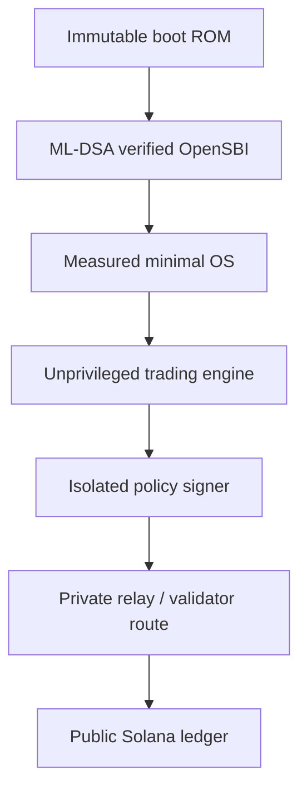

# Architecture and trust boundaries

The target is a secure trading appliance, not a monolithic "BIOS that trades."
Firmware, operating system, signer, and relay have different privilege and
failure domains.

## Firmware domain

The immutable boot ROM or first mutable stage performs these operations:

1. Validate fixed partition bounds before hashing any image.
2. Hash the next stage with SHA3-384.
3. Verify an ML-DSA-65 signature rooted in an immutable public key.
4. Reject rollback below a hardware monotonic security version.
5. Extend a measured-boot register.
6. Lock root secrets and PMP configuration.
7. Enter verified OpenSBI, which supplies the standard interface between
   machine-mode firmware and the supervisor-mode OS.

For resilience during migration, a production update format can require both
ML-DSA and a mature classical signature.  This is a policy choice; it does not
change Solana transaction signatures.

## OS domain

Use a reproducible, immutable image with:

- Read-only root filesystem and signed A/B updates
- IOMMU enabled and unused devices disabled
- No swap, core dumps, interactive compilers, or package manager
- Separate Unix identities and mandatory access control for market data,
  strategy, transaction construction, signer client, and relay client
- Outbound firewall allowlisting only configured RPC, time, and relay targets
- Local RPC responses treated as untrusted input
- Independent monitoring that has no signing authority

The OS may run on minimal Linux initially.  Writing a new kernel and a new
firmware stack at the same time would greatly enlarge the security boundary.

## Solana signer domain

Solana messages are signed with Ed25519, so the live Solana key must remain in
an isolated signer that implements Ed25519 even when the boot chain is
post-quantum protected.

The signer should accept a high-level, typed order intent and construct the
allowlisted Solana message itself.  It should not offer a generic
`sign_arbitrary_bytes` endpoint.

At minimum it enforces:

- Exact cluster/genesis identity
- Exact DEX program IDs and instruction discriminators
- Exact input/output mint allowlists
- Maximum position, notional, slippage, fee, compute-unit price, and tip
- Recent-blockhash or durable-nonce policy
- Destination and token-account ownership checks
- No unexpected writable or signer accounts
- No address-lookup tables unless separately pinned and verified
- Monotonic request nonce and rate limit
- Manual two-person authorization above a configured exposure threshold

Keep treasury assets in a separate cold or MPC-controlled account.  The hot
trading key should only control a deliberately capped balance.

## Transaction routing and privacy

A direct validator/block-engine route can reduce exposure before inclusion.
It cannot make the resulting trade private after it lands.  Solana account
addresses, invoked programs, and normal transaction contents become public
ledger data.

Jito's transaction endpoint forwards directly to a validator and advertises
MEV protection; bundles contain up to five signed transactions and execute
sequentially and atomically if selected.  This is a relay trust relationship,
not cryptographic confidentiality.

Solana's Confidential Transfer extension hides token amounts and balances for
compatible Token-2022 mints, while account addresses remain public.  It does
not make arbitrary DEX trading confidential.

## Post-quantum boundary

Post-quantum protection applies to:

- Firmware and OS update signatures
- Recovery authorization
- Device-to-management-plane identity
- Encrypted backups and long-term audit archives

It does not apply to an ordinary Solana transaction until the Solana protocol
accepts a post-quantum transaction signature scheme.  A local custom CPU
instruction cannot change consensus verification rules.

